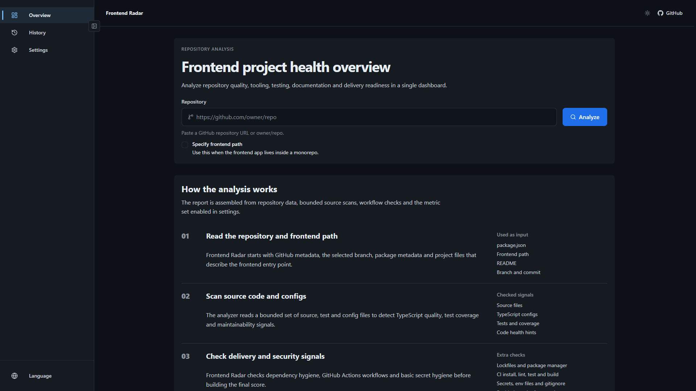
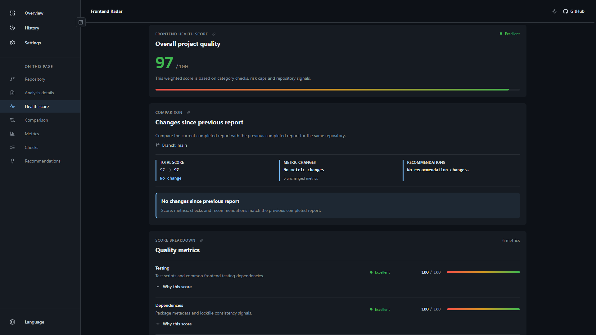
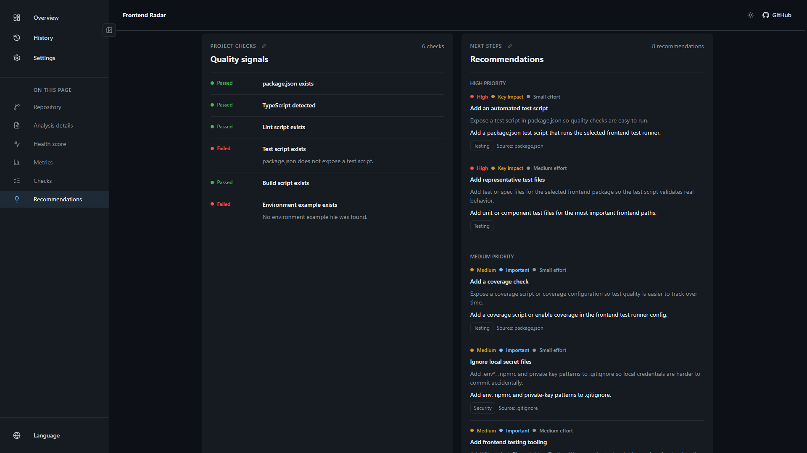
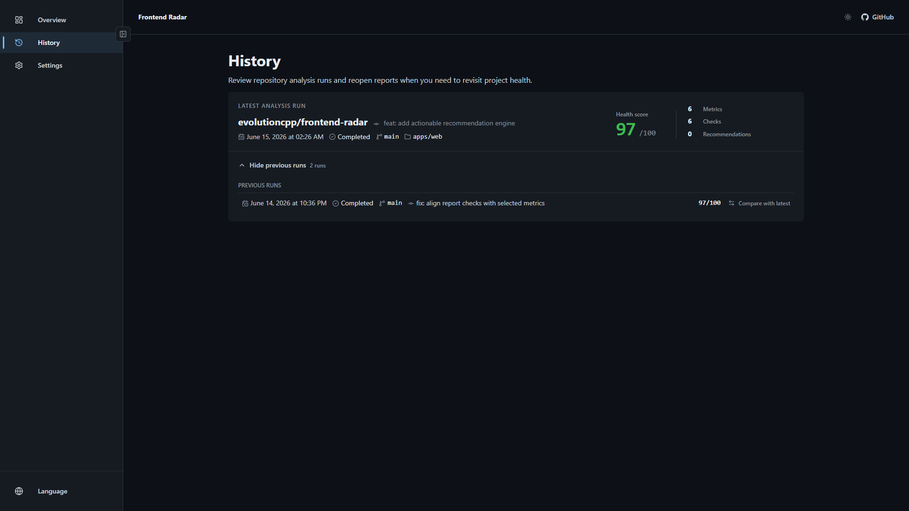

# Frontend Radar

[English](README.md) | [Русский](README.ru.md)

Frontend Radar анализирует frontend-репозитории и превращает сигналы проекта в понятный health report с метриками, рекомендациями, историей и сравнением отчётов.



## Что Проверяет

- metadata репозитория и выбранный frontend path;
- package metadata, lockfile и согласованность package manager;
- исходники, TypeScript configs, тестовые файлы и coverage-сигналы;
- качество GitHub Actions workflow;
- базовую гигиену безопасности и секретов;
- поддерживаемость, производительность и accessibility-сигналы;
- практические рекомендации с влиянием и сложностью.

## Скриншоты







## Стек

- React 19, Vite, Redux Toolkit и RTK Query
- Fastify, Zod, Prisma и PostgreSQL
- Vitest, Playwright и Storybook
- Docker Compose для локальной базы данных

## Требования

- Node.js 24+
- npm
- Docker или Docker Desktop

## Быстрый Старт

Установите зависимости:

```bash
npm install
```

Создайте локальные env-файлы:

```bash
cp apps/api/.env.example apps/api/.env
cp apps/web/.env.example apps/web/.env
```

В PowerShell:

```powershell
Copy-Item apps/api/.env.example apps/api/.env
Copy-Item apps/web/.env.example apps/web/.env
```

Запустите PostgreSQL и подготовьте базу:

```bash
npm run db:up
npm run db:deploy
npm run db:generate
```

Запустите приложение:

```bash
npm run dev
```

Откройте:

```text
http://localhost:5173
```

API будет доступно на:

```text
http://localhost:3001
```

## GitHub Token

Публичные репозитории можно анализировать без token, но лимиты GitHub API будут ниже.

Для приватных репозиториев или более высоких лимитов добавьте fine-grained GitHub token в настройках приложения. Token хранится только в браузере и отправляется backend-у как `x-github-token` для запросов анализа. Он не сохраняется в БД, отчётах или логах.

Рекомендуемые права fine-grained token:

- Contents: Read-only
- Metadata: Read-only

## Полезные Команды

| Команда | Описание |
| --- | --- |
| `npm run dev` | Запустить PostgreSQL, API и web dev servers |
| `npm run db:up` | Запустить PostgreSQL container |
| `npm run db:down` | Остановить Docker Compose services |
| `npm run db:deploy` | Применить Prisma migrations |
| `npm run db:migrate` | Создать и применить dev migration |
| `npm run db:generate` | Сгенерировать Prisma client |
| `npm run check` | Запустить SCSS type check, format check, lint, build и tests |
| `npm run check:full` | Запустить полные проверки вместе с e2e |
| `npm run api:generate -w apps/web` | Перегенерировать RTK Query API client |
| `npm run scss:types -w apps/web` | Перегенерировать SCSS module typings |

## Структура Проекта

```text
apps/
  api/   Fastify API, анализ отчётов, scoring и persistence
  web/   React dashboard
packages/
  github-repository/
  localization/
scripts/
  dev.mjs
```

## Заметки Для Разработки

- Prisma migrations лежат в `apps/api/prisma/migrations`.
- Generated RTK Query client коммитится в репозиторий.
- SCSS module `.d.ts` файлы коммитятся в репозиторий.
- Локальные `.env` файлы, build output, coverage и Playwright reports игнорируются.

## Лицензия

MIT
